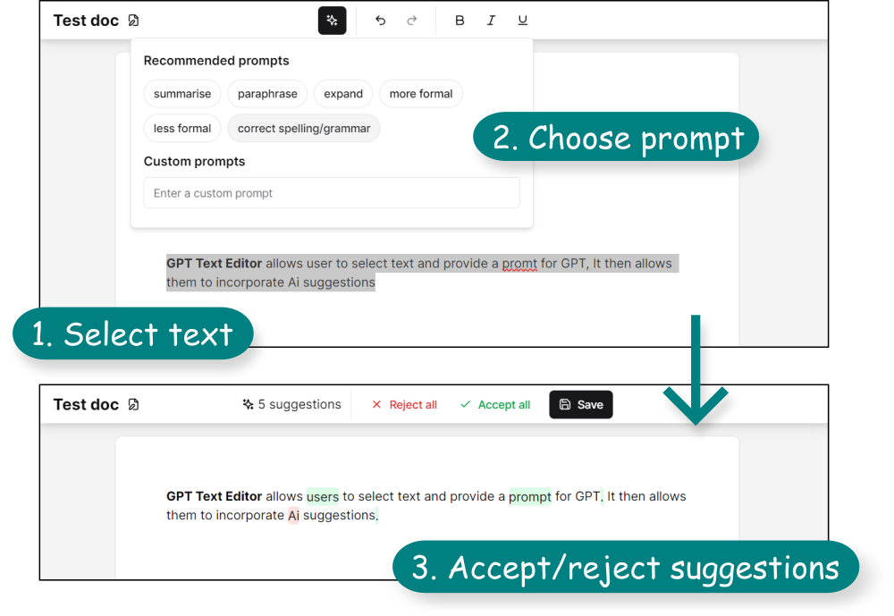

<div align="center">

# ✨ GPT Text Editor

A rich text editor web app allowing you to incorporate AI suggestions into a document



</div>

### Features
- [x] Rich text editor
- [x] Autosave files to local storage
- [x] Suggested and custom edit prompts
- [x] Accept or deny individual AI suggestions
- [x] Error handling
- [ ] User authentication
- [ ] Cloud document storage
- [ ] Dark mode

### Setup
Requires [OpenAI API key](https://platform.openai.com/api-keys) inside ```.env.local```
